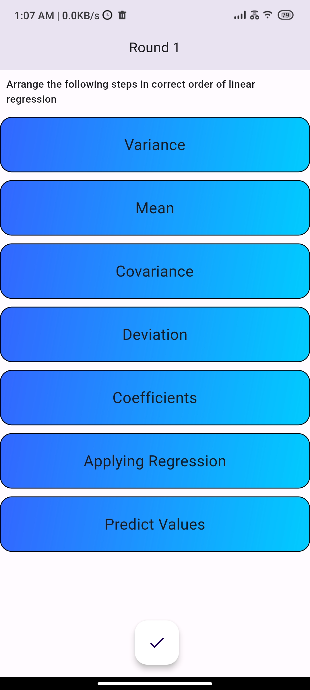
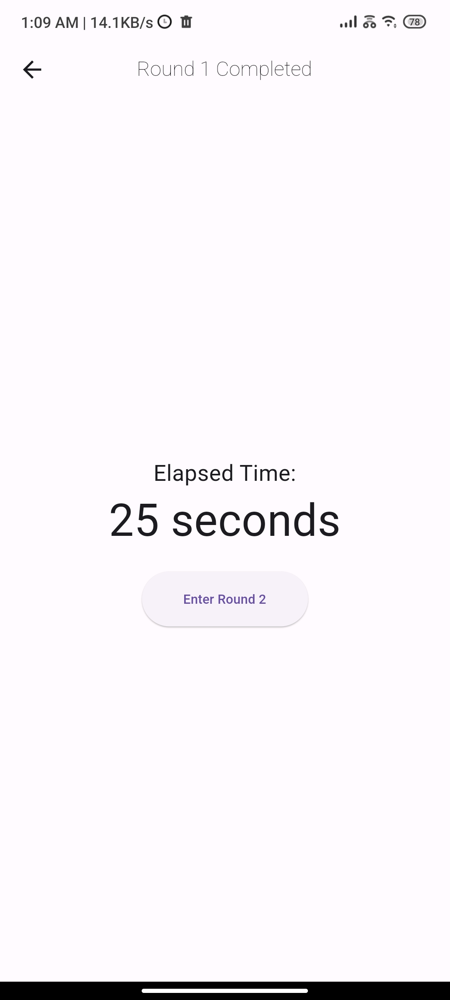
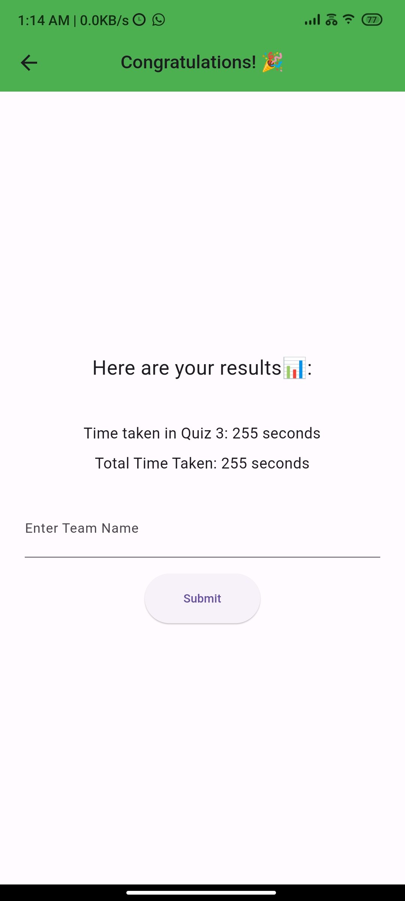

# Go Algo in AI Odyssey - Flutter Game App

Welcome to the **Go Algo in AI Odyssey** Flutter game application repository! This app is developed for the "AI Odyssey," which is Central India's biggest event focusing on recent trends in Artificial Intelligence. The game, "Go Algo," is designed to challenge players with AI-powered algorithms and enhance their problem-solving skills in an engaging and entertaining way.

## Getting Started

To get started with the Go Algo game, you can follow these steps:

1. **Prerequisites:** Make sure you have Flutter installed on your machine. If not, you can download and install it from the official Flutter website.

2. **Clone the Repository:** Clone this repository to your local machine using the following command:

```bash
git clone https://github.com/your-username/go-algo-ai-odyssey.git
```

3. **Navigate to Directory:** Change your current directory to the cloned repository:

```bash
cd go-algo-ai-odyssey
```

## Installation

Before running the app, ensure that you have all the required dependencies installed. You can do this by executing the following command:

```bash
flutter pub get
```

## Usage

To run the Go Algo game application, use the following command:

```bash
flutter run
```

This command will launch the app on a connected device or an emulator.

## Setting up Backend Server with Appwrite

To enable online features such as leaderboards, you need to set up a backend server. We will use Appwrite as our backend service. Follow these steps to set up Appwrite:

1. **Sign Up on Appwrite:** Visit the [Appwrite website](https://appwrite.io) and sign up for a new account.

2. **Create a New Project:** Once logged in, create a new project for "Go Algo in AI Odyssey."

3. **Set Up Database:** In your Appwrite project, create a new database collection to store leaderboard data.

4. **Enable API Keys:** Generate API keys in the "API Keys" tab to authenticate your Flutter app with Appwrite.

5. **Update Flutter App Configuration:** Open your Flutter app and find the configuration file (e.g., lib/app_config.dart). Update the API endpoint and project ID with the values from your Appwrite project.

6. **Integrate Appwrite SDK:** In your Flutter app, integrate the [Appwrite SDK](https://github.com/appwrite/sdk-for-flutter) to communicate with the Appwrite backend.

7. **Implement Backend:** Use the Appwrite SDK to send and retrieve data from your Appwrite backend.

## Contributing

We welcome contributions to improve and enhance the Go Algo in AI Odyssey game app. If you would like to contribute, please follow these steps:

1. Fork the repository.

2. Create a new branch with a descriptive name for your feature or bug fix.

3. Commit your changes and push the branch to your fork.

4. Submit a pull request to this repository, explaining the changes you have made.

We appreciate your valuable contributions!

---
## Glimp's of UI

| Screen 1                    | Screen 2                    | Screen 3                    | Screen 4                    |
| --------------------------- | --------------------------- | --------------------------- | --------------------------- |
|  |  |  |  |

---
Thank you for your interest in Go Algo in AI Odyssey! We hope you enjoy playing the game and learning more about AI algorithms through this interactive experience. We have made the game as open-source so any body can make the changes in UI and backend and use it. 🚀
